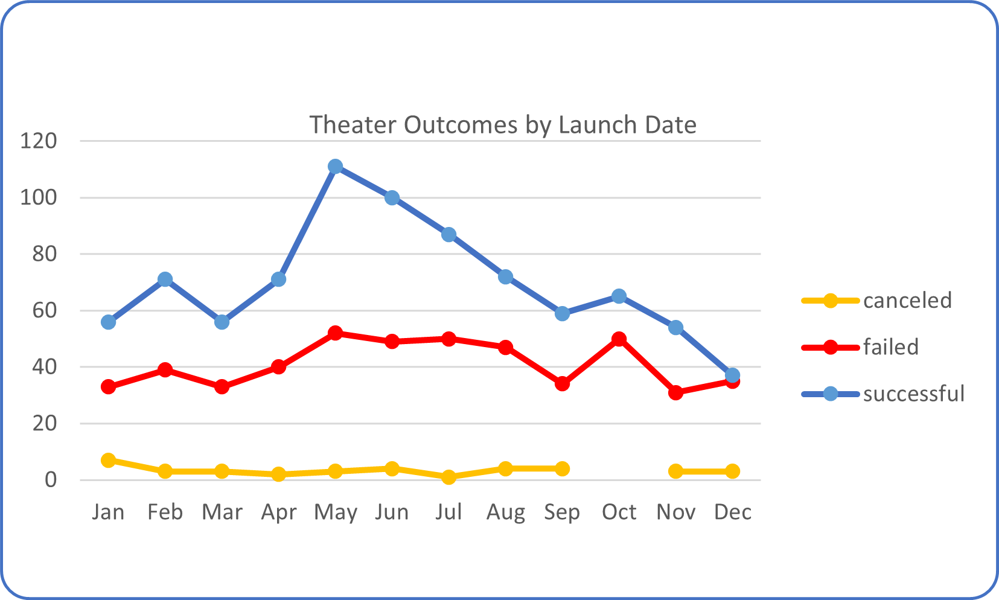
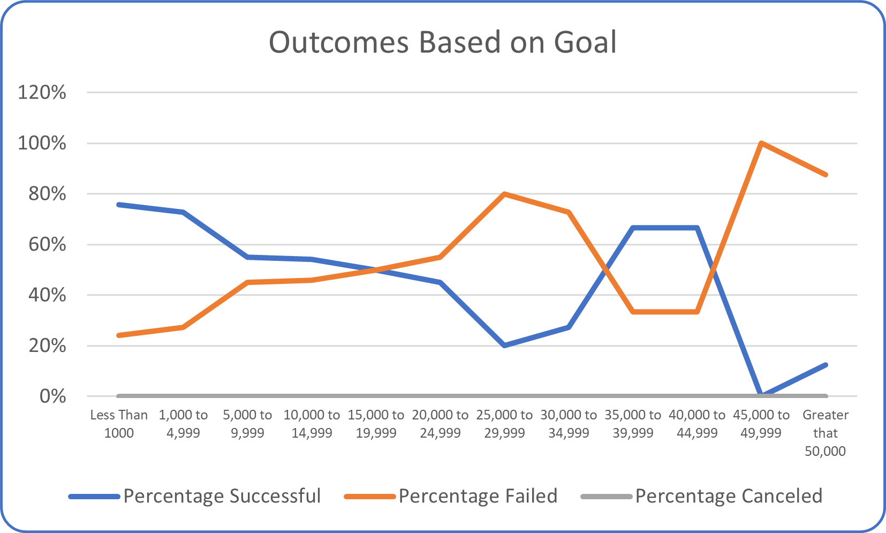

# Kickstarting with Excel

## Overview of Project

The main objective of the project was to provide Louise with the information and visualize campaign outcomes based on their launch dates for the Theater & plays categories and their funding goals.

The information and outcomes for this report were obtained from a dataset with past Kickstarter campaigns with valuable trends.

### Purpose

This report would help Loise to know how different campaigns performed in relation to their launch dates and their funding goals for the categories she is most interested on to make better choices for their upcoming fundraising campaigns and be more successful.

## Analysis and Challenges

### Analysis of Outcomes Based on Launch Date

From this analysis, based on the date’s campaigns are launched, we can observe that the campaigns launched in the months of May, June and July are the are the most successful, peaking in May where we can get and average of 66% of effectiveness.
Campaigns launched during the initial and last months of the year are probably not a good idea.

### Analysis of Outcomes Based on Goals

Now, for this table and line chart we can observe that most of the campaigns with a goal of less than 1,000 and up to 4,999 are the most successful reaching and average above of 70%, we can also observe that these range is also where most of the projects are located probably because goal was easier to achieve. The most unsuccessful campaigns are the ones who set with goals over $45,000 with a few projects. 

### Challenges and Difficulties Encountered

The original data from the excel required some formatting changes such as creating human readable dates, add an extra column with the corresponding year of the campaigns and splitting a column to create the required sub-categories for proper classification of the data. Once this was achieved, we were able to filter data and insert the dynamic tables to create the required tables and visualizations.

## Results

Findings:
From Analysis of Outcomes based on Launch Date: 

-	May, June & July are the most successful months to launch a Kickstarter campaign for a Theatrical play and May is the most successful month. 

-	Avoid launching campaigns from September to March 😉

From Analysis of Outcomes based on Goals:

-	The campaigns with a goal of less than 1,000 and up to 4,999 have a higher success rate however the success of a campaign cannot be measured solely if the fundraising goal.
	

Limitations:
The dataset is outdated, last available information dates to 3 years ago (2017).
There are 13 different currencies and 21 countries, and the dataset is heavily loaded towards to the United States, the 74% of the Kickstarter data is from the US whereas only 15% of the data belongs to Great Britain that she is also interested on.

  
Additional charts and tables:
We could create additional charts and tables that are suited better to the likes and needs of Louise aimed the demographics and plays she is most interested on.

Identification of outliers is something Louise could use to better plan her campaign by eliminating extreme data points that are not representative of the data that she needs.
